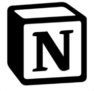

# <strong>Hello🖐,My name is Nurtazim!</strong>
## <i> I'm Nurtazim, and I am a student of **Jyldyz Academy** </i>
## <i>I want to be a *frontend-developer*!</i>

___

## <strong>Langs and Tools</strong>

----

## <strong> Skills and Tools  </strong>

|Soft Skills|
|---------|
|🥇🥇🥇🥇🥇|

|Coding|
|---------|
|🥇🥇🥇🥇🥇|

|Design|
|---------|
|🥇🥇🥇🥇|

<b>My statistic⚽</b>

